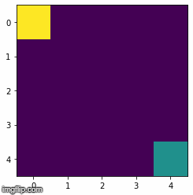

# Q-learning-Path-finder
This project focuses on implementing a reinforcement learning methodology called Q-learning on 4X4 grid world environment. The grid navigates from a start point to end point avoiding obstacles.

The basic environment for this project consists of size of 4X4 grid that is compatible with Open Ai Gym environments. The start block is initialized to the index [0,0] and the destination is at [4,4]. It is expected that the steps taken to reach the final destination should be the least. A reward is assigned for whatever steps the agent takes. It will receive a reward of +1 for moving closer to the destination and -1 reward for moving away from the destination. The model is trained in such a way that the agent would be able to reach the destination within fair number of epochs. The start block can move in 4 direction top, bottom left and right.

The abstract of the project, report and results can be found [here](report.pdf) .
